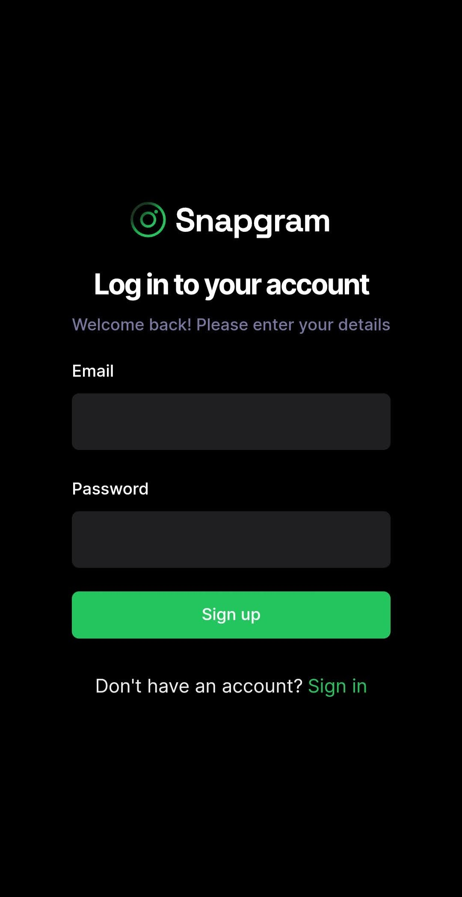
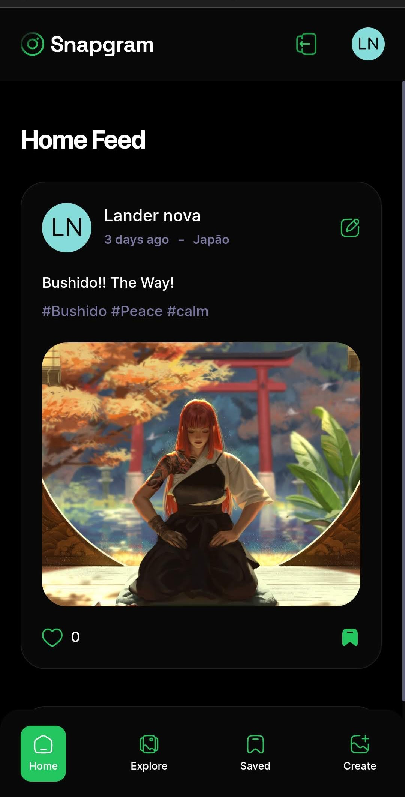
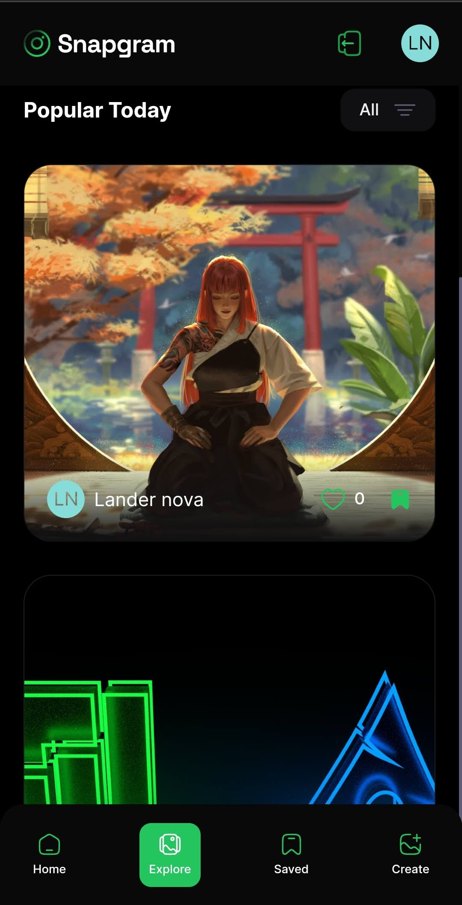

# Social App - Desenvolvimento de Aplicação Social Moderna

Este projeto, inspirado no Instagram, é o resultado de um curso prático conduzido por pelo Javascript Mastery onde construimos uma aplicação Full-stack com Next.Js. A aplicação apresenta uma interface de usuário atraente, proporcionando uma experiência nativa para dispositivos móveis. Abaixo, destaco as principais tecnologias utilizadas e o que aprendi durante o desenvolvimento deste projeto.

## visualização projeto


### Login



### Feed




### Criação Post


### Explorar



## Tecnologias Utilizadas

- **ReactJs:** Utilizei a versão mais recente do React para explorar suas funcionalidades mais avançadas e desenvolver uma aplicação moderna e eficiente.

- **Next.js 14:** Implementei o framework React para renderização do lado do servidor, facilitando a criação de aplicações web robustas.

- **Appwrite:** Integrado para autenticação, armazenamento e gerenciamento de banco de dados, proporcionando um backend sem servidor.

- **TypeScript:** Adotei TypeScript para adicionar tipagem estática ao JavaScript, melhorando a manutenibilidade e prevenindo erros.


## O Que Aprendi

- **Desenvolvimento Full-Stack:** Tornei-me proficiente na criação de uma aplicação web completa, desde configuração do ambiente até a implantação.

- **Exploração do React:** Aprofundei meus conhecimentos no React, explorando recursos avançados e aprimorando minhas habilidades de desenvolvimento.

- **Exploração do Next.js 14:** Aprofundei meus conhecimento nas mais novas features do Next.js 14.

- **Integração com Appwrite:** Aprendi a integrar e utilizar uma plataforma sem servidor para autenticação e gerenciamento de dados.

- **TypeScript na Prática:** Ganhei experiência prática na utilização do TypeScript para tornar meu código mais seguro e legível.

- **Boas Práticas de Desenvolvimento:** Adotei boas práticas de desenvolvimento, incluindo organização de código, modularização e uso eficiente de recursos externos.

## Como Utilizar o Projeto

1. **Clone o Repositório:**
    ```bash
    git clone https://github.com/adrianhajdin/social-app.git
    ```

2. **Instale as Dependências:**
    ```bash
    cd social-app
    npm install
    ```

3. **Execute o Projeto:**
    ```bash
    npm run dev
    ```

4. **Acesse a Aplicação:**
   Abra o navegador e acesse [http://localhost:3000](http://localhost:3000).

## Próximos Passos

Este projeto marca um passo significativo na minha jornada de desenvolvimento, e estou ansioso para aplicar esses conhecimentos em futuros desafios. Sigo comprometido com a aprendizagem contínua e aprimoramento das minhas habilidades. Seja bem-vindo(a) a explorar o código-fonte e ficarei grato pelo seu feedback!

**Marcadores:** React, Next.js, TypeScript, Appwrite, Desenvolvimento Full-Stack, Desenvolvimento Web.